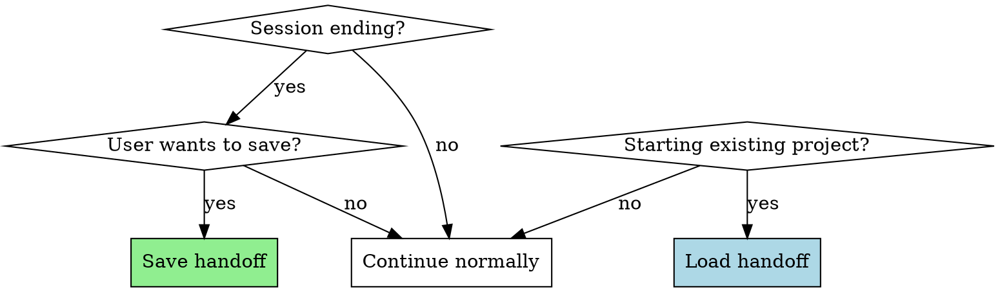

# Handoff

## Overview

Preserve context across Claude Code sessions through structured markdown documents in `docs/handoffs/`.

**Core principle:** Before ending a session or when switching contexts, save the current state. When resuming, load the saved context to maintain continuity.

## When to Use



**Use when:**
- User says "save", "handoff", "checkpoint", "pause", "continue later"
- User wants to resume previous work
- Session is ending and user wants to preserve progress
- User asks "what were we working on?"
- Starting work on an existing project with `docs/handoffs/`

**Don't use for:**
- New projects with no existing context
- Simple single-session tasks
- Questions that can be answered from git history

## Quick Reference

| Action | When | How |
|--------|------|-----|
| Save context | Session ending, user requests save | Create `docs/handoffs/<name>-<version>.md` |
| Load context | Starting existing project | Find latest handoff, read and present |
| Version format | Milestones | `v1`, `v2`, `v3`... |
| Version format | Daily snapshots | `YYYY-MM-DD` |

## Saving Context (Session → Document)

When user wants to save:

1. **Ask for project name** and version format (v1/v2/... or YYYY-MM-DD)
2. **Prompt for handoff information:**
   - Context Overview (project, objectives, architecture)
   - Current Status (completed, in progress, TODO)
   - Key Decisions & Rationale
   - Important File Locations
   - Development Guidelines
   - Blockers & Risks
3. **Generate** `docs/handoffs/<name>-<version>.md`
4. **Suggest git commit** to preserve the handoff

## Loading Context (Document → Session)

When user wants to continue or asks about previous work:

1. **Find latest handoff** in `docs/handoffs/` for the project
2. **Read and present:**
   - Context Overview summary
   - Current Status (especially TODO items)
   - Key decisions and file locations
3. **Ask:** "What would you like to work on?"

## Handoff Document Template

```markdown
# <Project Name> Handoff

**Created:** YYYY-MM-DD
**Version:** vX

## Context Overview

- **Project:**
- **Objectives:**
- **Architecture:**

## Current Status

### Completed
-
-

### In Progress
-

### TODO
-
-

## Key Decisions & Rationale

-

## Important File Locations

-

## Development Guidelines

-

## Blockers & Risks

-

## References

-
```

## File Locations

- Handoff documents: `docs/handoffs/`
- Template: `docs/handoffs/template.md`
- README: `docs/handoffs/README.md`

## Common Mistakes

| Mistake | Fix |
|---------|-----|
| Saving without TODO items | Always include current state and next steps |
| Using complex versioning | Use simple v1, v2 or YYYY-MM-DD |
| Forgetting file locations | Include paths to important files |
| Not suggesting git commit | Handoffs should be committed to version control |

## Real-World Impact

- Seamless continuation after breaks
- Onboarding new assistants to existing projects
- Recovery from context loss
- Project state snapshots
