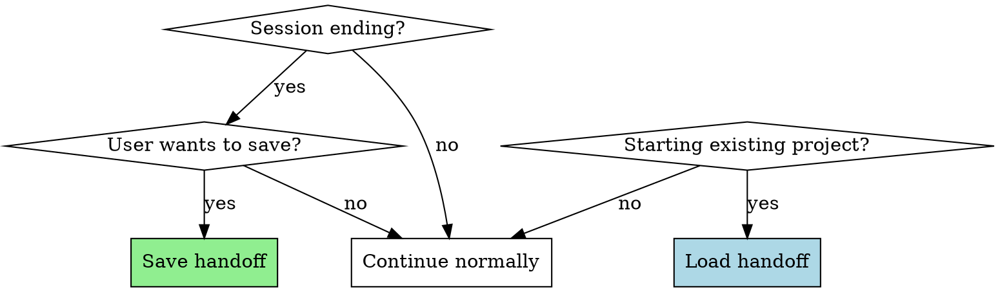

# Handoff

## Commands

The assistant should recognize and respond to these command patterns:

### `/handoff:save [options]`

**Trigger patterns:**
- `/handoff:save --name <feature-name>`
- `/handoff:save --name <feature-name> --continue v0.0.1`
- `save handoff <feature-name>`
- "save checkpoint"
- "save my progress"
- "checkpoint"

**Options:**
- `--name <feature-name>` - Feature/project name (required)
- `--continue <version>` - Chain from previous handoff version

**Action:**
1. Parse name parameter
2. Determine version: Find existing versions, increment patch (v0.0.1 → v0.0.2)
3. Collect session context (project background, current status, decisions, files, TODOs)
4. Generate handoff document at `docs/handoffs/<name>-v<version>.md`
5. Display success message with file path
6. **Remind user to run `/compact`** to clean and organize session

**Example output:**
```
✅ Handoff saved: docs/handoffs/blog-to-profile-sync-v0.0.1.md

💡 Tip: Run `/compact` to clean up the current session before closing.
```

**Version format:**
- Automatic patch versioning: v0.0.1, v0.0.2, v0.0.3...
- Each save increments the patch number

### `/handoff:continue <feature-name|path>`

**Trigger patterns:**
- `/handoff:continue <feature-name>`
- `/handoff:continue docs/handoffs/<feature-name>-v0.0.1.md`
- `continue handoff <feature-name>`
- "resume work on <feature-name>"
- "continue where we left off"
- "what were we working on?"

**Action:**
1. **Auto-find handoffs:**
   - If path provided: use that file directly
   - If feature name provided: search `docs/handoffs/<name>-v*.md`
2. **Find latest version:**
   - Sort by version number (v0.0.3 > v0.0.2 > v0.0.1)
   - Pick the most recent one
3. **Show available handoffs and ask for confirmation:**
   ```
   Found handoff(s) for "blog-sync":
   📄 blog-sync-v0.0.3.md (26-01-29 14:30:15)
   📄 blog-sync-v0.0.2.md (26-01-28 09:15:20)

   Load latest: blog-sync-v0.0.3.md? [Y/n]
   ```
4. **After confirmation, read and present:**
   - Context Overview summary
   - Current Status (especially TODO items)
   - Key decisions and file locations
5. **If handoff references previous version, offer to load it**
6. **Ask:** "What would you like to work on?"

**Example output:**
```
📋 Loading handoff: blog-sync-v0.0.3

## Context Overview
Project: Blog to Profile Sync Feature
Objectives: Sync blog posts to user profile...

## Current TODO
1. [ ] Implement API endpoint
2. [ ] Add error handling
...

What would you like to work on?
```

## Overview

Preserve context across Claude Code sessions through structured markdown documents in `docs/handoffs/`.

**Core principle:** Before ending a session or when switching contexts, save the current state. When resuming, load the saved context to maintain continuity.

**Version format:** Automatic patch versioning (v0.0.1, v0.0.2, v0.0.3...) - each save increments the version number.

## When to Use



**Use when:**
- User types commands: `/handoff:save`, `/handoff:continue`
- User says "save", "handoff", "checkpoint", "pause", "continue later"
- User wants to resume previous work
- Session is ending and user wants to preserve progress
- User asks "what were we working on?"
- Starting work on an existing project with `docs/handoffs/`

**Don't use for:**
- New projects with no existing context
- Simple single-session tasks
- Questions that can be answered from git history

## Quick Reference

| Action | Command | When | How |
|--------|---------|------|-----|
| Save context | `/handoff:save --name <feature-name>` | Session ending, user requests save | Create document with auto version |
| Load context | `/handoff:continue <feature-name>` | Starting existing project | Find latest, confirm, then present |
| Version format | Automatic | Every save | v0.0.1, v0.0.2, v0.0.3... |
| Session cleanup | `/compact` | After saving handoff | Manual command to clean session |

## Saving Context (Session → Document)

When user triggers `/handoff:save` or requests to save:

1. **Parse options:** Extract name parameter
2. **Determine version:**
   - Search for `<name>-v*.md` files in `docs/handoffs/`
   - Extract highest version number
   - Increment patch number (e.g., v0.0.5 → v0.0.6)
   - If no existing files, start from v0.0.1
3. **Collect handoff information:**
   - Context Overview (project, objectives, architecture)
   - Current Status (completed, in progress, TODO)
   - Key Decisions & Rationale
   - Important File Locations
   - Development Guidelines
   - Blockers & Risks
4. **Generate document:** Create `docs/handoffs/<name>-v<version>.md`
   - Include timestamp in format: `yy-MM-DD hh:mm:ss`
5. **Display result:** Show success message with file path
6. **Remind user:** Suggest running `/compact` to clean session

**Important:**
- Always remind user to run `/compact` after creating handoff document
- Version numbers are automatic and increment on each save
- Timestamp format: `yy-MM-DD hh:mm:ss` (e.g., 26-01-29 14:30:15)

## Loading Context (Document → Session)

When user wants to continue or asks about previous work:

1. **Search for handoffs:**
   - Use Glob to find `docs/handoffs/<name>-v*.md`
   - List all matching files
2. **Sort and select latest:**
   - Extract version numbers from filenames
   - Compare numerically (v0.0.3 > v0.0.2 > v0.0.1)
   - Select the most recent
3. **Show options and confirm:**
   ```
   Found handoff(s) for "<feature-name>":
   📄 <feature-name>-v0.0.3.md (26-01-29 14:30:15)
   📄 <feature-name>-v0.0.2.md (26-01-28 09:15:20)

   Load latest: <feature-name>-v0.0.3.md? [Y/n]
   ```
4. **Read and present after confirmation:**
   - Context Overview summary
   - Current Status (especially TODO items)
   - Key decisions and file locations
5. **Ask:** "What would you like to work on?"

**Version comparison logic:**
- Extract version from filename: `<name>-v<version>.md`
- Parse semantically: `major.minor.patch`
- Compare: v0.0.3 > v0.0.2 > v0.0.1

## Handoff Document Template

```markdown
# <Project Name> Handoff

**Created:** yy-MM-DD hh:mm:ss
**Version:** v0.0.X

## Context Overview

- **Project:**
- **Objectives:**
- **Architecture:**

## Current Status

### Completed
-
-

### In Progress
-

### TODO
-
-

## Key Decisions & Rationale

-

## Important File Locations

-

## Development Guidelines

-

## Blockers & Risks

-

## References

-
```

**Timestamp format:** `yy-MM-DD hh:mm:ss`
- Example: `26-01-29 14:30:15` (January 29, 2026, 2:30:15 PM)

## File Locations

- Handoff documents: `docs/handoffs/`
- Template: `docs/handoffs/template.md`
- README: `docs/handoffs/README.md`

## Common Mistakes

| Mistake | Fix |
|---------|-----|
| Saving without TODO items | Always include current state and next steps |
| Forgetting file locations | Include paths to important files |
| Not suggesting git commit | Handoffs should be committed to version control |
| Forgetting to run /compact | Remind user to compact session after saving |
| Manual version numbering | Let the system auto-increment versions |

## Real-World Impact

- Seamless continuation after breaks
- Onboarding new assistants to existing projects
- Recovery from context loss
- Project state snapshots
- Automatic version tracking without manual management
